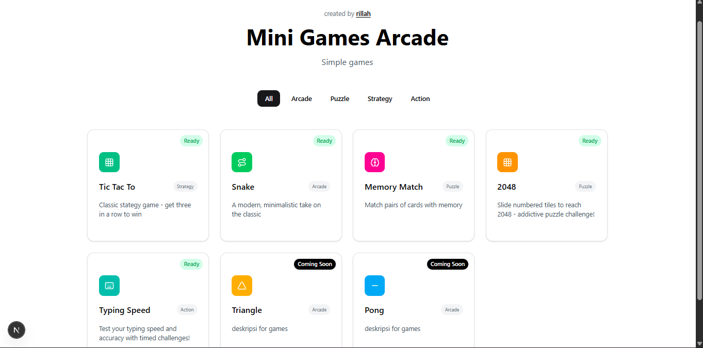
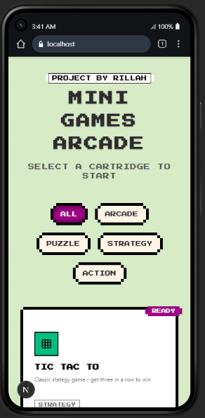

## MINI GAMES ARCADE

Dibangun dengan Next.js 16 dan React 19

---




---

### Game Status

- [x] Tic Tac Toe
- [x] Snake
- [x] Memory Match
- [x] Puzzle 2048
- [x] Typing Speed
- [ ] Flappy Triangle
- [ ] Quick Math Game
- [ ] Pong
- [ ] Minesweeper

---

### Struktur Project

```
src/
├── app/
│   └── games/[id]/             # Dynamic routing navigasi game
├── components/
│   └── ui/
│       └── 8bit/styles/        # Komponen UI dengan tema retro/8-bit kustom
├── data/                       # Konfigurasi statis dan metadata game
├── games/
│   └── molecules/              # Komponen presentasional inti permainan
├── hooks/                      # Custom hooks (useTicTacToe, usePuzzle2048, dll)
├── lib/                        # Utilitas pembantu dan helper functions
└──  types/                     # Definisi TypeScript interface & types
```